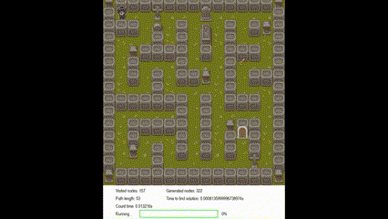
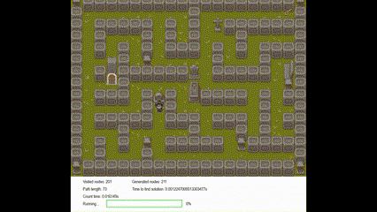
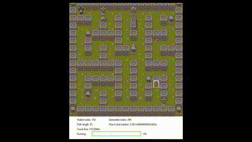
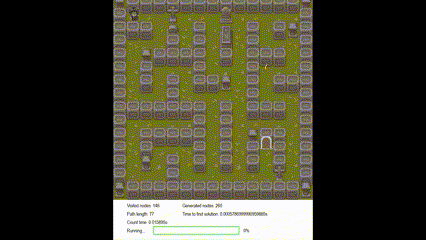
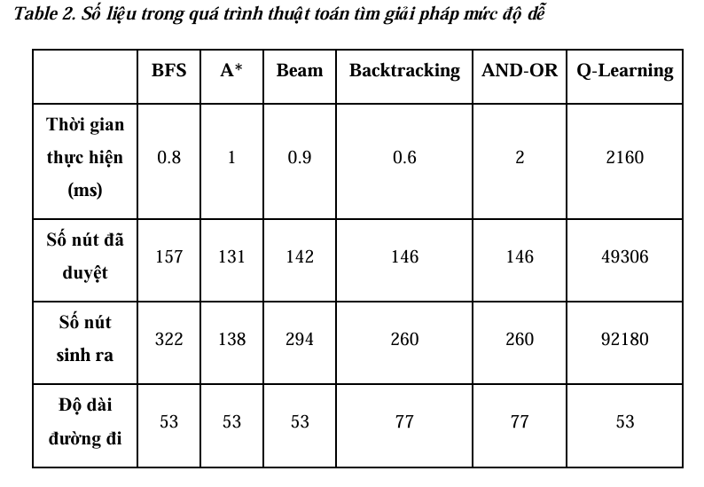
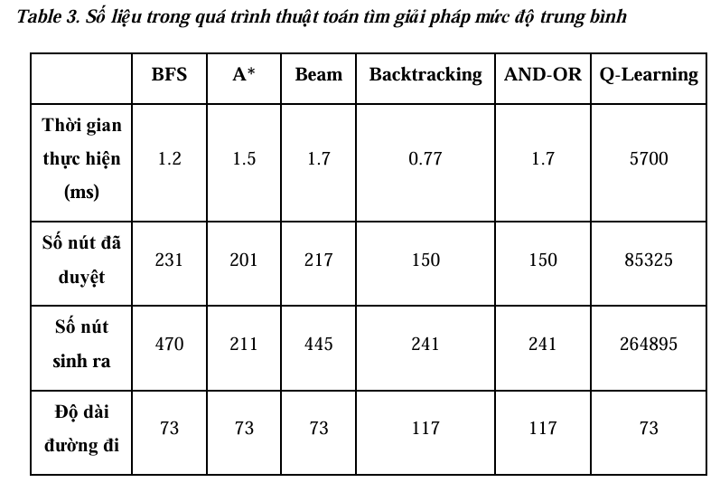
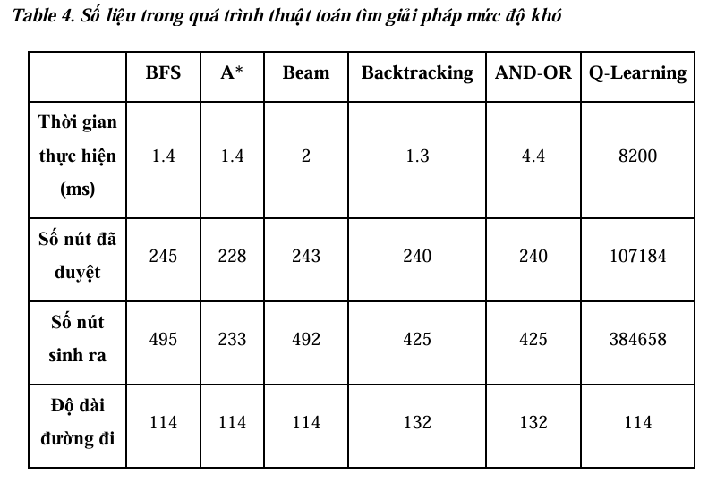
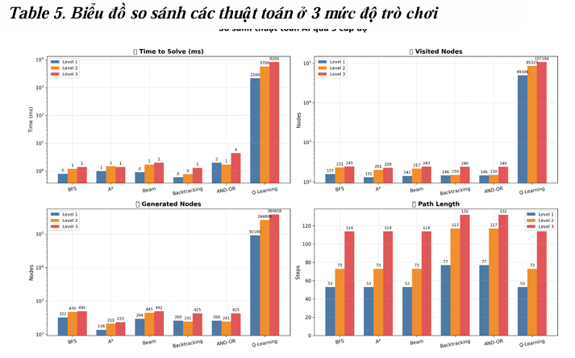

# BÁO CÁO CUỐI KÌ

Môn học: Trí Tuệ Nhân Tạo

# MAZE ESCAPE (THOÁT KHỎI MÊ CUNG MA THUẬT)

Giảng viên hướng dẫn: TS.Phan Thị Huyền Trang

## Mục tiêu

Đồ án này nhằm mục tiêu tìm hiểu và áp dụng các thuật toán tìm kiếm trong bối cảnh bài toán mê cung — một dạng bài toán tìm đường trong không gian trạng thái có cấu trúc. Dự án tập trung vào việc triển khai, thử nghiệm và so sánh nhiều chiến lược tìm kiếm khác nhau, từ các phương pháp không sử dụng thông tin định hướng (như BFS, Backtracking), cho đến các kỹ thuật có sử dụng hàm heuristic (như A*, Beam Search), cũng như các mô hình học tăng cường (Q-learning) và tìm kiếm trong môi trường phi quyết định (And-Or Search).

Ngoài việc lập trình và kiểm thử các thuật toán trên nhiều bản đồ có độ phức tạp tăng dần, đồ án cũng chú trọng vào việc trực quan hóa quá trình giải — giúp làm nổi bật đặc điểm hoạt động của từng thuật toán. Từ đó, các chỉ số định lượng như thời gian tìm kiếm, số lượng nút sinh ra, số lượng nút duyệt, độ dài lời giải,... sẽ được thu thập và phân tích nhằm đưa ra đánh giá khách quan về hiệu quả của từng phương pháp.

## Nội dung

### 2.1.  Thuật toán tìm kiếm không có thông tin (Uninformed Search)

Thuật toán tìm kiếm không có thông tin là các thuật toán tìm kiếm mà không sử dụng bất kỳ thông tin bổ sung nào ngoài trạng thái ban đầu và các trạng thái liên quan. Các thuật toán này chỉ dựa vào việc mở rộng các trạng thái theo một thứ tự cụ thể mà không dựa vào đánh giá về chất lượng của các trạng thái đó. Do không có "thông tin thông minh", các thuật toán này có thể tốn kém về bộ nhớ và thời gian.

#### Ưu điểm:

Đơn giản và dễ hiểu, không yêu cầu thông tin bổ sung ngoài trạng thái ban đầu.

Tìm kiếm theo chiều rộng (BFS) đảm bảo tìm được giải pháp tối ưu nếu tồn tại.

#### Nhược điểm:

Tiêu tốn nhiều bộ nhớ và thời gian khi không gian trạng thái lớn.

Các thuật toán như DFS có thể không tìm được giải pháp nếu không có giới hạn độ sâu.

Không tối ưu trong những bài toán phức tạp, vì chúng không sử dụng thông tin bổ sung để hướng dẫn tìm kiếm.

###### BFS (Tìm kiếm theo chiều rộng)

Thuật toán tìm kiếm theo chiều rộng (BFS) sẽ mở rộng các đỉnh của cây tìm kiếm từ gốc theo từng mức độ, kiểm tra tất cả các đỉnh cùng một mức trước khi chuyển sang mức tiếp theo.

Độ tối ưu: Tối ưu đối với các bài toán tìm kiếm vô hạn nếu không có thông tin.

Độ phức tạp: O(b^d), với b là độ rộng của cây và d là độ sâu của cây tìm kiếm.

###### DFS (Tìm kiếm theo chiều sâu)

DFS sẽ đi sâu vào một nhánh của cây tìm kiếm cho đến khi không thể mở rộng tiếp, rồi quay lại điểm phân nhánh và thử các nhánh khác.

Độ tối ưu: Không tối ưu trong trường hợp không có giới hạn độ sâu.

Độ phức tạp: O(b^d).

###### IDS (Tìm kiếm theo chiều sâu lặp lại)

Là sự kết hợp giữa DFS và BFS, IDS thực hiện DFS với các độ sâu giới hạn và tăng dần độ sâu cho đến khi tìm thấy giải pháp.

Độ tối ưu: Tốt nhất trong việc sử dụng bộ nhớ khi tìm kiếm trong không gian lớn.

Độ phức tạp: O(b^d), nhưng sử dụng bộ nhớ ít hơn so với BFS.

###### UCS (Tìm kiếm chi phí đồng nhất)

UCS tìm kiếm theo chi phí, mở rộng các đỉnh có chi phí thấp nhất trước.

Độ tối ưu: Tìm kiếm tối ưu trong các bài toán có chi phí không âm.

Độ phức tạp: O(b^d).

Ở nhóm thuật toán này, nhóm sử dụng BFS cho bài toán giải mê cung.

#### Hình ảnh gif minh họa giải thuật BFS trên các level:

Level 1

Level 2

Level 3

### 2.2. Thuật toán tìm kiếm có thông tin (Informed Search)

Thuật toán tìm kiếm có thông tin sử dụng thông tin bổ sung (như hàm đánh giá hoặc hàm heuristic) để hướng dẫn quá trình tìm kiếm. Thông tin này giúp thuật toán lựa chọn những trạng thái tiềm năng hơn để mở rộng, giúp cải thiện hiệu quả tìm kiếm và giảm thiểu chi phí tính toán. Đây là những thuật toán tìm kiếm hiệu quả hơn so với các thuật toán tìm kiếm không có thông tin, đặc biệt trong không gian trạng thái lớn.

#### Ưu điểm:

Tìm kiếm hiệu quả hơn nhờ sử dụng thông tin bổ sung (hàm đánh giá heuristic).

Các thuật toán như A* có thể tìm được giải pháp tối ưu trong không gian trạng thái có thông tin đầy đủ.

#### Nhược điểm:

Cần phải có một hàm đánh giá tốt, nếu không thuật toán có thể không tối ưu hoặc tốn kém tài nguyên.

Các thuật toán như A* hoặc Greedy có thể tốn thời gian và bộ nhớ khi không gian trạng thái rất lớn.

###### Greedy

Thuật toán Greedy đưa ra lựa chọn tốt nhất trong bước hiện tại mà không quan tâm đến tương lai, nhằm tối ưu hóa bước tiếp theo.

Độ tối ưu: Không tối ưu, có thể dẫn đến giải pháp không chính xác.

Độ phức tạp: O(b^d).

###### A* (A-star)

A* kết hợp giữa tìm kiếm theo chi phí và tìm kiếm theo độ gần với mục tiêu, sử dụng hàm đánh giá f(n) = g(n) + h(n) để lựa chọn đỉnh tiếp theo.

Độ tối ưu: Tìm kiếm tối ưu nếu hàm đánh giá h(n) không vượt quá chi phí thực tế.

Độ phức tạp: O(b^d).

###### IDA* (Iterative Deepening A*)

IDA* kết hợp giữa IDS và A*, thực hiện A* với độ sâu lặp lại để tiết kiệm bộ nhớ.

Độ tối ưu: Tối ưu khi cần tiết kiệm bộ nhớ.

Độ phức tạp: O(b^d).

Ở nhóm thuật toán này, nhóm sử dụng A* cho bài toán giải mê cung.

#### Hình ảnh gif minh họa thuật toán A* trên các level:

Level 1

Level 2

Level 3

### 2.3. Thuật toán tìm kiếm cục bộ (Local Search)

Thuật toán tìm kiếm cục bộ tìm kiếm trong không gian trạng thái chỉ xung quanh vị trí hiện tại mà không cần phải theo dõi toàn bộ không gian trạng thái. Điều này giúp tiết kiệm bộ nhớ, nhưng cũng có thể dẫn đến các vấn đề như mắc kẹt tại tối ưu cục bộ. Các thuật toán này thích hợp cho những bài toán có không gian trạng thái lớn, nhưng không đảm bảo sẽ tìm được giải pháp tối ưu toàn cục.

#### Ưu điểm:

Tiết kiệm bộ nhớ và tính toán vì chỉ tìm kiếm trong một phần không gian trạng thái.

Các thuật toán như Simulated Annealing có thể tránh được tối ưu cục bộ và tìm được tối ưu toàn cục trong một số trường hợp.

#### Nhược điểm:

Không đảm bảo tìm ra giải pháp tối ưu toàn cục.

Các thuật toán như SHC có thể bị kẹt ở một tối ưu cục bộ nếu không có chiến lược làm lạnh thích hợp (như Simulated Annealing).

###### SHC (Simple Hill Climbing)

SHC là một thuật toán tìm kiếm cục bộ đơn giản, trong đó tại mỗi bước, thuật toán chỉ chọn một trạng thái kề tốt hơn trạng thái hiện tại (nếu có) và chuyển đến đó. Thuật toán dừng khi không tìm được trạng thái nào tốt hơn.

Độ tối ưu: Không đảm bảo tìm được tối ưu toàn cục, dễ rơi vào bẫy tối ưu cục bộ.

Độ phức tạp: O(b^d).

###### SAHC (Steepest-Ascent Hill Climbing)

SAHC là biến thể của SHC, trong đó tại mỗi bước, thuật toán đánh giá tất cả các trạng thái kề và chọn trạng thái có giá trị đánh giá tốt nhất (dốc nhất) để di chuyển.

Độ tối ưu: Vẫn không đảm bảo tìm được tối ưu toàn cục vì vẫn có thể mắc kẹt tại cực trị cục bộ hoặc cao nguyên.

Độ phức tạp: O(b^d).

###### Stochastic HC (Stochastic Hill Climbing)

Là một phiên bản ngẫu nhiên của SHC, nơi các bước đi không nhất thiết phải theo chiều dốc.

Độ tối ưu: Không tối ưu.

Độ phức tạp: O(b^d).

###### Beam Search

Thuật toán tìm kiếm cục bộ này chỉ mở rộng một số đỉnh giới hạn tại mỗi mức.

Độ tối ưu: Có thể không tối ưu vì giới hạn số đỉnh mở rộng.

Độ phức tạp: O(b^k), với k là số lượng beam.

###### Simulated Annealing

Thuật toán làm lạnh mô phỏng mô phỏng quá trình vật lý của làm lạnh từ từ để tránh tối ưu cục bộ.

Độ tối ưu: Tìm tối ưu toàn cục trong không gian trạng thái lớn.

Độ phức tạp: O(b^d).

###### Genetic Algorithm

Thuật toán di truyền mô phỏng quá trình chọn lọc tự nhiên để tìm ra giải pháp tối ưu.

Độ tối ưu: Tìm giải pháp gần tối ưu.

Độ phức tạp: O(b^d).

Ở nhóm thuật toán này, nhóm sử dụng Beam Search cho bài toán giải mê cung.

#### Hình ảnh gif minh họa thuật toán Beam Search trên các level:

Level 1

Level 2

Level 3

### 2.4. Thuật toán ràng buộc (CSPs - Constraint Satisfaction Problems)

Thuật toán ràng buộc được sử dụng để giải quyết các bài toán trong đó các biến phải thỏa mãn một tập hợp các ràng buộc. Những bài toán này thường gặp trong các lĩnh vực như phân công, lịch trình, và tổ chức. Các thuật toán ràng buộc không chỉ tìm kiếm một giải pháp mà còn phải kiểm tra tính hợp lệ của các lựa chọn trong suốt quá trình tìm kiếm.

#### Ưu điểm:

Tốt cho các bài toán có ràng buộc rõ ràng, như phân bổ tài nguyên hoặc lập kế hoạch.

Các thuật toán như Min-Conflicts có thể tìm được giải pháp tốt với các bài toán ràng buộc phức tạp.

#### Nhược điểm:

Các thuật toán này không phải lúc nào cũng có thể áp dụng cho tất cả loại bài toán tìm kiếm.

Tốn thời gian và tài nguyên khi số lượng ràng buộc và biến tăng lên.

###### Backtracking

Thuật toán quay lại, thử các lựa chọn khác nhau và quay lại khi gặp mâu thuẫn.

Độ tối ưu: Tìm kiếm giải pháp tối ưu.

Độ phức tạp: O(b^d), có thể giảm với việc cắt tỉa (pruning).

###### Forward Checking

Kiểm tra các ràng buộc phía trước để loại bỏ các lựa chọn không khả thi.

Độ tối ưu: Tối ưu hơn backtracking khi kiểm tra trước.

Độ phức tạp: O(b^d), nhưng có thể giảm đáng kể.

###### Min-Conflicts

Thuật toán tìm giải pháp tối ưu bằng cách giảm số lượng mâu thuẫn tại mỗi bước.

Độ tối ưu: Có thể tìm kiếm giải pháp tối ưu hoặc gần tối ưu.

Độ phức tạp: O(b^d), tùy vào cách cắt tỉa và số mâu thuẫn.

Ở nhóm thuật toán này, nhóm sử dụng Backtracking cho bài toán giải mê cung.

#### Hình ảnh gif minh họa thuật toán Backtracking trên các level:

Level 1

Level 2

Level 3

### 2.5. Thuật toán tìm kiếm trong môi trường phức tạp (Complex Environment)

Thuật toán tìm kiếm trong môi trường phức tạp được áp dụng trong các bài toán mà môi trường không hoàn toàn rõ ràng hoặc không đầy đủ thông tin. Những thuật toán này có thể làm việc trong các tình huống không chắc chắn, nơi các thông tin về trạng thái không có sẵn hoặc chỉ có thể đoán được, ví dụ như trong các bài toán tìm kiếm sensorless hoặc tìm kiếm And-Or.

#### Ưu điểm:

Phù hợp với các bài toán có sự không chắc chắn hoặc không đầy đủ thông tin.

Các thuật toán như Sensorless hoặc And-Or Search có thể giải quyết các vấn đề trong môi trường phức tạp mà các thuật toán truyền thống gặp khó khăn.

#### Nhược điểm:

Cần có môi trường và sự mô phỏng phức tạp, điều này có thể tăng độ khó và chi phí tính toán.

Các thuật toán này có thể kém hiệu quả nếu môi trường không được mô tả rõ ràng hoặc thiếu dữ liệu.

###### Sensorless

Thuật toán tìm kiếm làm việc trong môi trường không có thông tin về trạng thái.

Độ tối ưu: Không tối ưu, vì thiếu thông tin từ môi trường.

Độ phức tạp: O(b^d).

###### And-Or Search

Tìm kiếm trong môi trường phân nhánh, tìm kiếm các chuỗi hành động phù hợp với các ràng buộc.

Độ tối ưu: Tìm kiếm giải pháp tối ưu cho các bài toán phân nhánh.

Độ phức tạp: O(b^d).

Ở nhóm thuật toán này, nhóm sử dụng And-Or Search cho bài toán giải mê cung.

#### Hình ảnh gif minh họa thuật toán AND-OR trên các level:

Level 1

Level 2

Level 3

### 2.6. Thuật toán học tăng cường (Reinforcement Learning)

Thuật toán học tăng cường là một phương pháp học máy trong đó một tác nhân học cách hành động tối ưu trong một môi trường thông qua việc nhận thưởng hoặc phạt sau mỗi hành động. Thay vì tìm kiếm giải pháp từ trước, tác nhân học qua kinh nghiệm và cải thiện hiệu suất qua thời gian. Điều này giúp giải quyết các bài toán phức tạp và động, nơi môi trường có thể thay đổi theo từng bước.

#### Ưu điểm:

AI có thể học hỏi từ môi trường và tối ưu hóa hành vi của mình theo thời gian.

Phù hợp với các bài toán động và không chắc chắn, nơi môi trường thay đổi theo từng hành động.

#### Nhược điểm:

Cần một lượng lớn dữ liệu và thời gian để huấn luyện.

Các thuật toán như Q-Learning có thể không hiệu quả trong không gian trạng thái lớn hoặc phức tạp mà không có chiến lược học thích hợp.

###### Q-Learning

Thuật toán học tăng cường, học từ kinh nghiệm bằng cách tối ưu hóa giá trị Q cho các trạng thái và hành động.

Độ tối ưu: Tìm kiếm giải pháp tối ưu với đủ số lần học.

Độ phức tạp: O(b^d), phụ thuộc vào việc cập nhật Q-table.

Ở nhóm thuật toán này, nhóm sử dụng Q-Learning cho bài toán giải mê cung.

#### Hình ảnh gif minh họa thuật toán Q-Learning trên các level:

Level 1

Level 2

Level 3

## Phân tích và đánh giá hiệu quả các thuật toán áp dụng vào bài toán mê cung

Qua biểu đồ, ta thấy được có sự khác biệt rõ rệt về hiệu suất mà các thuật toán mang lại khi độ khó của mê cung tăng dần lên. Các thuật toán có xu hướng tốn nhiều thời gian hơn, duyệt và sinh nhiều nút hơn, cùng với độ dài đường đi tăng lên đáng kể.

Đầu tiên, xét về thời gian giải (tính theo mili giây). Các thuật toán như BFS, A* và Beam Search, Backtracking có thời gian tìm đường nhanh và ổn định (khoảng 1-2ms ở tất cả cấp độ). And-Or cũng tương đối ổn nhưng ở mức độ khó lại tăng mạnh thời gian giải so với hai mức độ trước đó. Q-Learning cho thời gian cao hơn đáng kể (lên tới 18 8000ms ở mức độ khó) do bản chất phải cập nhật trạng thái và trải nghiệm học nhiều lần để tìm được đường đi tốt nhất.

Tiếp theo, về số nút duyệt và nút sinh. A* là thuật toán nổi trội hơn tất cả về hiệu suất, số lượng nút duyệt và sinh thấp nhất (khoảng 130-230), khoảng cách giữa nút duyệt và nút sinh cũng cách nhau không nhiều. Ngược lại, các thuật toán còn lại thì có sự chênh lệch đáng kể giữa nút được sinh ra và nút được duyệt, gây tốn tài nguyên, đặc biệt là Q-Learning với số lượng nút đáng kể.

Cuối cùng, về đồ dài đường đi. BFS, A*, Beam Search và Q-Learning luôn cho kết quả đường đi ngắn nhất và ổn định. Trong khi đó, Backtracking và And-Or có xu hướng cho ra đường đi dài hơn và phức tạp hơn.

Dựa vào các phân tích trên, có thể thấy rõ A* là thuật toán nổi bật nhất, cân bằng giữa thời gian, hiệu quả không và chất lượng đường đi, đây là thuật toán vô cùng phù hợp cho bài toán mê cung. BFS là thuật toán đơn giản nhưng vẫn mang lại kết quả khá tốt trong các bản đồ không quá phức tạp. Tuy nhiên, do không xét chi phí nên BFS dễ sinh ra nhiều trạng thái thừa ở bản đồ lớn hơn. Beam Search hoạt động nhanh nhờ chỉ xét một lượng trạng thái giới hạn tại mỗi bước, nhưng có nguy cơ bỏ qua lời giải tối ưu nếu beam width quá nhỏ. Backtracking và And-Or là các thuật toán suy diễn, thường không ưu tiên hiệu năng nên thường có thời gian giải chậm hơn và đồ dài đường đi thiếu sự tối ưu. Q-Learning cần lượng lớn thời gian để huấn luyện, đi kèm theo đó cũng sinh ra số lượng trạng thái cực kì lớn, nhưng khi được huấn luyện tốt, nó vẫn có thể đưa ra lời giải tối ưu.

## Kết luận

Việc áp dụng đa dạng các nhóm thuật toán tìm kiếm vào bài toán giải mê cung đã tạo điều kiện thuận lợi để phân tích và so sánh hiệu quả của từng chiến lược trong các môi trường khác nhau. Từ các thuật toán không sử dụng thông tin như BFS, Backtracking, đến các phương pháp có sử dụng hàm đánh giá như A*, Beam Search, và các kỹ thuật nâng cao như And-Or Search và Q-Learning, mỗi thuật toán đều thể hiện những ưu và nhược điểm riêng biệt về hiệu suất, độ tối ưu và chi phí tính toán.

Thông qua quá trình xây dựng, thử nghiệm và trực quan hóa kết quả, dự án không chỉ giúp củng cố kiến thức về thuật toán mà còn phát triển tư duy hệ thống, kỹ năng phân tích và đánh giá giải pháp theo tiêu chí định lượng. Thực nghiệm cũng cho thấy tầm quan trọng của việc lựa chọn chiến lược tìm kiếm phù hợp với đặc điểm cụ thể của môi trường – đặc biệt là khi có thêm yếu tố như cổng dịch chuyển, vật phẩm và kẻ thù.

Từ đây, đồ án mở ra triển vọng ứng dụng các kỹ thuật tìm kiếm vào những bài toán phức tạp hơn trong lĩnh vực trí tuệ nhân tạo, game AI và điều hướng robot trong môi trường thực tế hoặc mô phỏng.
